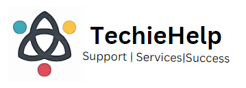

# 🤖 TechieHelp-AI Chatbot Assistant
Amit kumar


TechieHelp-AI Chatbot Assistant is an intelligent and user-friendly assistant designed to provide seamless support to users. It leverages advanced AI capabilities to answer queries related to TechieHelp and beyond. With secure login/signup features and a host of useful tools, it's the perfect assistant for your needs! 🌟

---

## ✨ Features

- 🔐 **User Authentication**: Secure login and signup system with password hashing.
- 🧠 **AI-Powered Chatbot**: Provides accurate and insightful responses using Google Generative AI.
- 🕒 **Chat History**: View previous queries and responses in the sidebar for easy reference.
- 🎤 **Text-to-Speech**: Converts chatbot responses into audio for an enhanced experience.
- 📄 **Download as PDF**: Save chatbot responses as PDF files for offline access.
- 🔄 **Password Management**: Update your password securely anytime.
- 📱 **Responsive Design**: Intuitive and user-friendly interface.

---

## 🛠️ Tech Stack

- **Backend**: Python, Streamlit, MongoDB
- **AI Integration**: Google Generative AI
- **Frontend**: Streamlit
- **Other Libraries**: FPDF, pyttsx3, hashlib, dotenv, pymongo

---

## 🚀 Installation Guide

Follow these steps to set up the project locally:  

### 1️⃣ Clone the Repository  
```bash
git clone https://github.com/yourusername/techiehelp-chatbot.git
cd techiehelp-chatbot
```
## Project Setup 
``` 
techiehelp-chatbot/
│
├── gen.py                 # Main application script
├── requirements.txt       # Python dependencies
├── .env                   # Environment variables (not included in the repo)
├── README.md              # Project documentation
├── logo.png               # Project logo
├── mogodb.py           # Folder for UI screenshots
├── templates/             # HTML templates (if any)
└── venv/                  # Virtual environment folder (not included in the repo)

```

# 🎯 How to Use

### 🔐 Login/Signup:  
- Create a new account or log in with existing credentials.  

### 🧠 Interact with Chatbot:  
- Type your queries in the chatbot interface and receive AI-generated responses.  

### 🎤 Text-to-Speech:  
- Listen to chatbot responses with the audio feature.  

### 📄 Download Responses:  
- Save responses as PDFs for future reference.  

### 🔄 Manage Account:  
- Update your password securely in the settings.  

---

## 📸 Screenshots  

### Login Page  
  

### Signup Page  
  

### Chatbot Page  
  

### Change Password Page  
  

### History Page  
  


---

## 🤝 Contributing  

Contributions are welcome! To contribute:  

1. **Fork the repository**:  
   - Click the "Fork" button at the top of this repository.  

2. **Create a feature branch**:  
   ```bash
   git checkout -b feature-name
   ```

📧 Contact
For support or inquiries:

✉️ Email: amitk25783@gmail.com
🌐 GitHub Issues: Create an Issue

